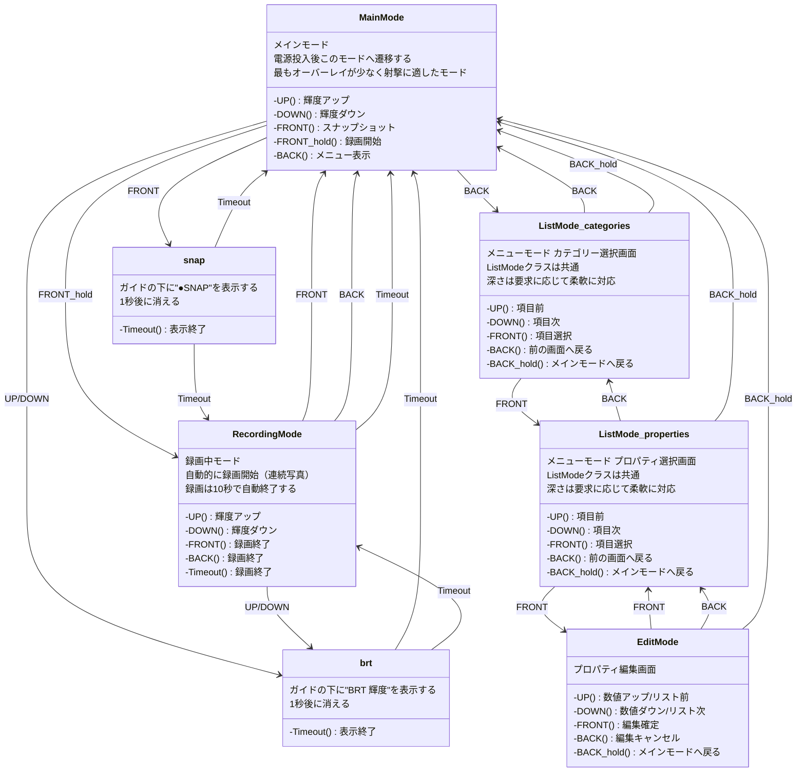

### ボタンシンボル
以下のシンボルが表示されている時、当該ボタンが有効になる。
`[◀B_HOLD]/[F_HOLD▶]`の表示が無いときは短押し/長押しの区別はない。
```
[◀B]        BACK
[◀B_HOLD]   BACK長押し
[F▶]        FRONT
[F_HOLD▶]   FRONT長押し
[ ▼]        UP
[▲▼]        UP/DOWN
[▲ ]        DOWN
```
項目の最上/最下、最大/最小で表示を切り替えてそれ以上進まないことを示す。
```
[ ▼]  項目の一番上/最大値
[▲▼]  項目の中間/中間値
[▲ ]  項目の一番下/最小値
```


### オーバーレイ
#### MainMode
背景透過/白文字（射撃優先仕様）
```
[▲▼]BRT
[F▶]SNAP
[F_HOLD▶]REC
[◀B]MENU
```

輝度最大
```
[ ▼]BRT
[F▶]SNAP
[F_HOLD▶]REC
[◀B]MENU
```

スナップショット時
`BRT`と`●REC`に被らない位置
RecordingMode時も同様
```
[ ▼]BRT
[F▶]SNAP
[F_HOLD▶]REC
[◀B]MENU

●SNAP    <-水色背景/白文字, 1秒間表示
```

輝度変更時
`BRT`と`●SNAP`に被らない位置
RecordingMode時も同様
```
[ ▼]BRT
[F▶]SNAP
[F_HOLD▶]REC
[◀B]MENU


BRT 10    <-白背景/青文字, 1秒間表示
```

#### RecordingMode
背景透過/白文字（射撃優先仕様）
mainオーバーレイからレイアウトを継承して`[F_HOLD▶]REC`の行を空ける
```
[▲▼]BRT
[F▶]STOP

[◀B]STOP
●REC 07s    <-赤背景/白文字, カウントダウン表示
```

同時にスナップショットと輝度変更
`[F_HOLD▶]REC`押下時間 > `●SNAP`表示時間 の場合は実現しないが定義しておく
```
[▲▼]BRT
[F▶]STOP

[◀B]STOP
●REC 07s
●SNAP
BRT 08
```

#### ListMode
青背景/白文字
一番上の項目を選択
```
«Categories»
[ ▼]Display    <-白背景/青文字, 以下同様
    Ballistic
    Calibration
    Color
[◀B]BACK  SELECT[F▶]
[◀B_HOLD]EXIT MENU
```
2番目の項目を選択
```
«Categories»
    Display
[▲▼]Ballistic
    Calibration
    Color
[◀B]BACK  SELECT[F▶]
[◀B_HOLD]EXIT MENU
```
3番目の項目を選択　ガイドは動かずリストがスクロール
```
«Categories»
    Ballistic
[▲▼]Calibration
    Color
    Power supply
[◀B]BACK  SELECT[F▶]
[◀B_HOLD]EXIT MENU
```
4番目の項目を選択　リストが一番下まで表示されたのでガイドが動く
```
«Categories»
    Ballistic
    Calibration
[▲▼]Color
    Power supply
[◀B]BACK  SELECT[F▶]
[◀B_HOLD]EXIT MENU
```
一番下の項目を選択
```
«Categories»
    Ballistic
    Calibration
    Color
[▲ ]Power supply
[◀B]BACK  SELECT[F▶]
[◀B_HOLD]EXIT MENU
```

#### EditMode
青背景/白文字
```
«Vertical offset»

 [▲▼] ＋１００ mm    <-数字のみ白背景/青文字, 大フォント

[◀B]CANCEL    OK[F▶]
[◀B_HOLD]EXIT MENU
```

最小値
```
«Vertical offset»

 [▲ ] －５００ mm    <-数字のみ白背景/青文字, 大フォント

[◀B]CANCEL    OK[F▶]
[◀B_HOLD]EXIT MENU
```


### 画面遷移図
